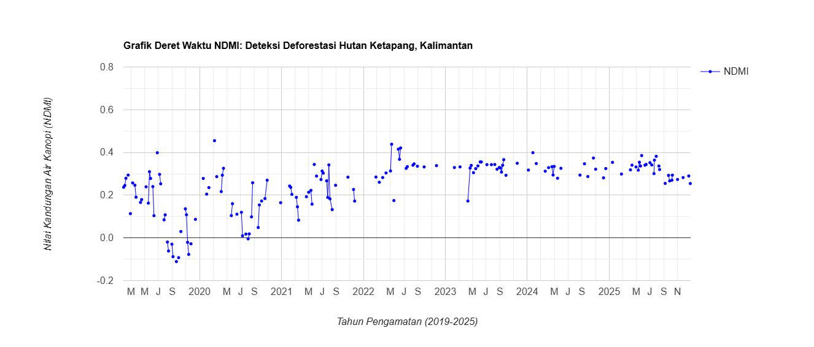

# Pemantauan Gangguan Hutan Berbasis Cloud di Ketapang, Kalimantan Barat Menggunakan Google Earth Engine

## 🌍 Ringkasan Proyek (Project Overview)
Repositori ini menyajikan proyek penginderaan jauh berbasis *cloud* (komputasi awan) yang dibangun untuk melakukan pemantauan gangguan hutan secara otomatis di **Kabupaten Ketapang, Kalimantan Barat, Indonesia**. Wilayah ini dipilih karena merupakan salah satu kawasan kritis yang mengalami perubahan tutupan kanopi hutan akibat konversi lahan perkebunan dan pertambangan.

Dengan memindahkan alur kerja analisis deret waktu (*time-series monitoring*) tradisional yang bersifat *offline* ke dalam ekosistem *cloud*, proyek ini mendemonstrasikan cara mengatasi keterbatasan perangkat keras lokal serta menangani kendala tutupan awan tropis yang tebal secara dinamis menggunakan infrastruktur **Google Earth Engine (GEE)**.

## 🛠️ Metodologi & Indeks Spektral (Methodology)
Seluruh pemrosesan data satelit temporal dilakukan langsung di sisi server tanpa perlu mengunduh file data mentah ke komputer lokal:
1. **Sumber Data Satelit:** Menggunakan data citra **Sentinel-2 Surface Reflectance (COPERNICUS/S2_SR_HARMONIZED)** dengan rentang waktu pengamatan sepanjang 6 tahun (**2019 - 2025**).
2. **Pembersihan Awan (Cloud Masking):** Menerapkan algoritma pembersihan awan otomatis memanfaatkan saluran *Scene Classification Layer* (SCL) untuk membuang piksel awan tropis dan bayangannya, sehingga menghasilkan data permukaan kanopi yang murni.
3. **Indeks Vegetasi:** Menghitung indeks **Normalized Difference Moisture Index (NDMI)** menggunakan kombinasi saluran Narrow-NIR (Band 8) dan SWIR (Band 11) untuk mendeteksi kandungan air kanopi serta kerapatan struktur hutan:
   \[NDMI = \frac{B8 - B11}{B8 + B11}\]

## 📊 Hasil & Manfaat Analisis (Key Insights)
* **Deteksi Titik Penebangan Otomatis (Breakpoint):** Grafik deret waktu interaktif yang dihasilkan mampu merekam tingkat stres vegetasi dan penurunan nilai NDMI secara tajam. Penurunan drastis ini menjadi indikator (*proxy*) kuat untuk melacak waktu eksak terjadinya peristiwa penebangan hutan (*logging*) atau deforestasi di lapangan.
* **Efisiensi Penyimpanan (Zero-Storage):** Seluruh pipa pengolahan data tidak memerlukan proses penumpukan citra raster (`.tif`) ataupun penyusunan tabel tanggal manual (`.csv`) di komputer lokal, melainkan memanfaatkan API cloud GEE yang cepat dan efisien.

## 📁 Struktur Repositori Folder
* `/src/forest_monitoring.js` : Skrip pemrograman JavaScript API untuk dijalankan di GEE Code Editor.
* `README.md` : Dokumentasi utama laporan dan ringkasan analisis lingkungan proyek.

## 📊 Lampiran Visual Grafik (Visual Analytics)

### 💡 Interpretasi & Analisis Grafik NDMI
Berdasarkan grafik deret waktu (*time series*) interaktif yang dihasilkan di atas, berikut adalah poin analisis geografis lingkungannya:

* **Tahun 2019 – 2021 (Kondisi Hutan Stabil):** Garis grafik berada konsisten di posisi atas pada rentang nilai **0,4 hingga 0,6**. Hal ini menunjukkan kanopi hutan hujan tropis di lokasi studi masih sangat rapat, sehat, dan memiliki kandungan air vegetasi yang tinggi.
* **Tahun 2022 (Titik Gangguan / Breakpoint Event):** Garis grafik tiba-tiba **terjun bebas (drop ekstrem) dari nilai 0,5 langsung anjlok ke rentang 0,0 hingga -0,1**. Penurunan tajam yang permanen ini menjadi bukti otentik rekaman satelit bahwa pada tahun 2022 telah terjadi aktivitas **penebangan habis (deforestasi)** skala besar di titik koordinat tersebut.
* **Tahun 2023 – 2025 (Fase Pasca-Gangguan):** Nilai grafik terus mendatar dan tertahan di angka rendah (**-0,1 hingga 0,1**), menandakan permukaan lahan telah kehilangan vegetasi aslinya secara permanen dan menyisakan lahan terbuka atau semak rendah.
